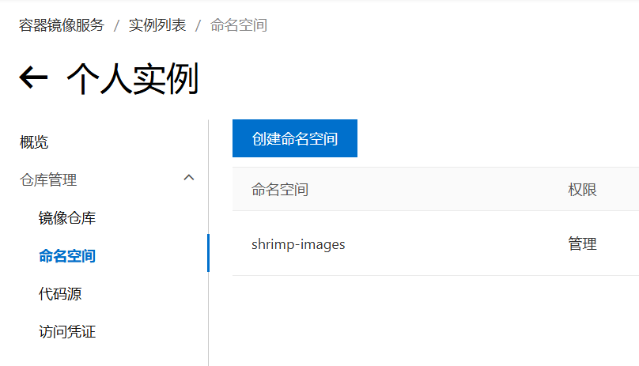

# Docker Images Pusher

使用 Github Action 将 DockerHub 镜像转存到阿里云私有仓库，供国内服务器使用，免费易用

- 视频教程 : [Docker镜像停服? 我编写了一个镜像转存工具，解决国内无法拉取docker镜像的问题](https://www.bilibili.com/video/BV1Zn4y19743/)
- 文字教程 : [Docker镜像停服? 我编写了一个镜像转存工具，解决国内无法拉取docker镜像的问题](https://www.bilibili.com/read/cv35249690/)

作者：**技术爬爬虾**

## 使用方式

### 配置阿里云
登录阿里云容器镜像服务
[https://cr.console.aliyun.com](https://cr.console.aliyun.com)
启用个人实例，创建一个命名空间（**ALIYUN_NAME_SPACE**）


访问凭证 –> 获取环境变量

- 命名空间 (**ALIYUN_NAME_SPACE**) : 上面一步中创建的命名空间名称
- 用户名 (**ALIYUN_REGISTRY_USER**) : 阿里云帐号
- 密码 (**ALIYUN_REGISTRY_PASSWORD**) 后面设置的密码
- 仓库地址 (**ALIYUN_REGISTRY**) 查看对应 `docker login` 命令中的最后一段


### Fork 本项目

进入本项目地址 [https://github.com/tech-shrimp/docker_image_pusher](https://github.com/tech-shrimp/docker_image_pusher)

点击 `Fork`，将项目复制到自己的名下

进入您自己的项目，点击 Action，启用 Github Action 功能
配置环境变量，进入 Settings -> Secret and variables -> Actions -> New Repository secret


将上一步的 `ALIYUN_NAME_SPACE`，`ALIYUN_REGISTRY_USER`，`ALIYUN_REGISTRY_PASSWORD`，`ALIYUN_REGISTRY` 的值配置成环境变量

### 添加镜像

打开 `images.txt` 文件，添加你想要的镜像，可以带 `tag`，也可以不用(默认`latest`)

也可添加 --platform=xxxxx 的参数指定镜像架构


文件提交后，自动进入 Github Action 构建

### 使用镜像

回到阿里云，镜像仓库，点击任意镜像，可查看镜像状态。(可以改成公开，拉取镜像免登录)


在国内服务器pull镜像

```
docker pull registry.cn-hangzhou.aliyuncs.com/shrimp-images/alpine
```

- `registry.cn-hangzhou.aliyuncs.com` 即 `ALIYUN_REGISTRY`
- `shrimp-images` 即 `ALIYUN_NAME_SPACE`
- `alpine` 即阿里云中显示的镜像名

### 多架构

阿里镜像服务个人版并不提供多架构功能，需要在 `images.txt` 中用 `--platform=xxxxx` 手动指定镜像架构
指定后的架构会以前缀的形式放在镜像名字前面


### 定时执行

修改 `/.github/workflows/docker.yaml` 文件
添加 `schedule` 即可定时执行 (注意: 此处 `cron` 使用 `UTC` 时区)

